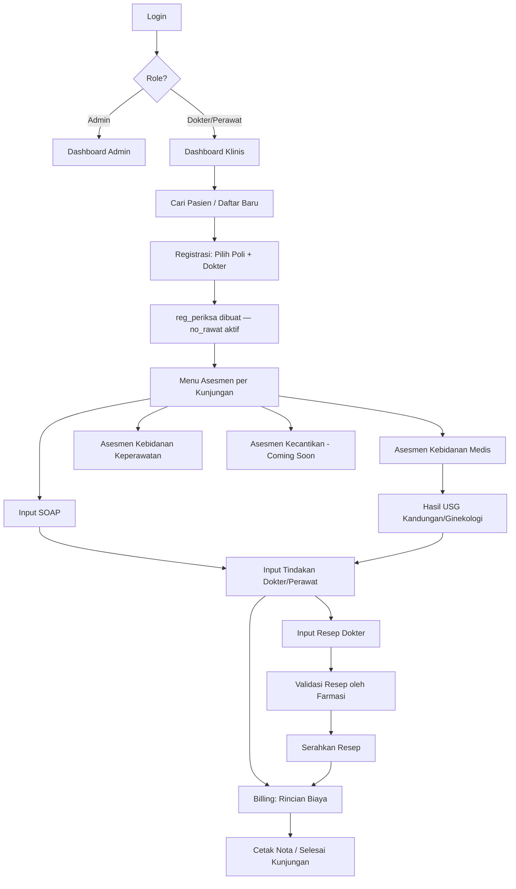

# Rencana Pengerjaan: SIMRS Khanza Web — Modul Klinik Kebidanan & Kecantikan

> **Status:** Draft perencanaan v1.0
> **Tujuan dokumen:** Menjadi acuan tunggal (single source of truth) selama pengerjaan, agar pengembangan tidak melenceng dari alur asli SIMRS Khanza dan tetap terstruktur per tahap.
> **Prinsip utama:** Database `sik` **tidak diubah sama sekali** (no `ALTER`, no kolom baru, no tabel baru kecuali eksplisit disepakati di Fase 6). Aplikasi ini adalah **antarmuka web (PHP native)** yang menjadi pelengkap aplikasi Java SIMRS Khanza yang sudah berjalan — bukan pengganti.

---

## 1. Latar Belakang & Ruang Lingkup

SIMRS Khanza versi utama berjalan di atas Java (NetBeans, `src/simrskhanza`) dengan database MySQL/MariaDB bernama `sik`. Selain aplikasi desktop Java, Khanza juga sudah memiliki sekumpulan **aplikasi web pelengkap berbasis PHP native** (folder `webapps/` pada repo resmi: `antrian.php`, `billing/`, `medrec/`, dll) yang berjalan di atas skema `sik` yang sama, tanpa mengubah struktur tabel.

Proyek ini mengikuti pola yang sama: membangun **modul web PHP baru** khusus untuk **klinik kecantikan dan kebidanan**, yang:

- Terhubung ke database `sik` yang sudah ada (read & write ke tabel-tabel native Khanza).
- Tidak mengubah/menambah kolom atau tabel pada skema `sik` bawaan.
- Menyediakan alur kerja yang lebih ringan dan fokus dibanding aplikasi Java penuh, khusus untuk kebutuhan poli kebidanan & kecantikan.
- Berjalan paralel dengan Java SIMRS Khanza (kedua aplikasi membaca/menulis ke database yang sama).

### Modul kecantikan
Modul "Asesmen Kecantikan" berstatus **coming soon**. Karena tabel native Khanza tidak punya skema untuk asesmen kecantikan, modul ini akan didesain strukturnya di awal tetapi implementasi backend-nya menyusul setelah disepakati pendekatan penyimpanan datanya (lihat Fase 6 & Catatan Terbuka).

---

## 2. Prinsip Non-Negosiasi

1. **Tidak ada perubahan skema database.** Semua INSERT/UPDATE/SELECT memakai tabel & kolom yang sudah ada di `sik.sql` bawaan Khanza.
2. **PHP native, prosedural, ringan** — mengikuti gaya `webapps/` Khanza (bukan Laravel/CodeIgniter penuh), supaya konsisten dengan ekosistem yang sudah dipahami tim dan mudah di-deploy di server yang sama dengan Khanza.
3. **Mengikuti penomoran `no_rawat` dan alur status Khanza** (lihat Bagian 4) — jangan membuat alur registrasi/billing paralel yang menyimpang dari konvensi Khanza, karena Java dan PHP harus saling "mengerti" data yang sama.
4. **Setiap fase punya Definition of Done** yang jelas sebelum lanjut fase berikutnya.
5. **Setiap halaman modul wajib mencatat `nip`/`kd_dokter` petugas yang menginput**, sesuai pola tabel asli (audit trail bawaan Khanza).

---

## 3. Skema Warna & Identitas UI

| Elemen | Warna | Hex | Catatan |
|---|---|---|---|
| Primary (header, sidebar aktif, tombol utama) | Merah maroon elegan | `#8B1538` | Lebih gelap dari merah "darurat", kesan profesional medis |
| Primary hover/active | Merah maroon gelap | `#6E0F2A` | |
| Accent (badge, highlight, link aktif) | Merah ruby | `#B91C3C` | |
| Background utama | Putih gading | `#FAFAFA` | |
| Card / panel | Putih | `#FFFFFF` | dengan shadow halus |
| Border / divider | Abu muda | `#E5E0E1` | sedikit warm-gray, bukan abu netral |
| Teks utama | Charcoal | `#2B2B2B` | |
| Teks sekunder | Abu | `#6B6B6B` | |
| Sukses (status "Sudah Bayar", "Valid") | Hijau tua muted | `#2F6B4F` | bukan hijau terang, biar tidak bertabrakan dengan merah |
| Warning (status "Belum", "Pending") | Amber muted | `#B8762E` | |
| Bahaya/hapus | Merah lebih terang dari primary | `#D62839` | dipakai khusus tombol delete agar beda dari brand merah |
| Sidebar background | Maroon sangat gelap | `#3D0A18` | dengan teks putih |

**Tipografi:** `Inter` atau `Plus Jakarta Sans` untuk UI, fallback system font. Ukuran dasar 14px, heading dengan letter-spacing sedikit rapat untuk kesan modern-klinis.

**Gaya visual:** flat design dengan sedikit elevasi (shadow lembut `0 2px 8px rgba(0,0,0,0.06)`), radius sudut 8–10px, tidak gradient mencolok, ikon line-style (bukan filled) agar terasa elegan bukan ramai.

---

## 4. Pemetaan Alur ke Tabel Database (`sik`)

Ini adalah peta acuan wajib — **setiap modul PHP harus merujuk ke tabel ini, tidak boleh membuat tabel sendiri di luar daftar ini tanpa diskusi.**

### 4.1 Login & Hak Akses
| Kebutuhan | Tabel | Kolom kunci |
|---|---|---|
| Login user (admin/dokter/perawat) | `user` | `id_user`, `password`, ratusan flag modul `enum('true','false')` per fitur |
| Data identitas petugas | `petugas` | `nip`, `nama`, `jk`, `kd_jbtn` |
| Data identitas dokter | `dokter` | `kd_dokter`, `nm_dokter`, `kd_sps` |
| Data pegawai master | `pegawai` | `nik`, `nama`, `jbtn` |

> Catatan: tabel `user` punya kolom flag modul yang sangat banyak (>500 kolom boolean). Untuk modul baru ini kita **tidak menambah kolom baru** ke `user`. Hak akses level modul baru cukup dibedakan dari `role` sederhana: cek apakah user terhubung ke `dokter` (kd_dokter ada) → role dokter; jika hanya ke `petugas` → role perawat/bidan; admin ditentukan manual via whitelist `id_user` di config (bukan kolom baru di DB).

### 4.2 Registrasi Pasien
| Kebutuhan | Tabel | Kolom kunci |
|---|---|---|
| Cari pasien lama | `pasien` | `no_rkm_medis`, `nm_pasien`, `no_ktp`, `tgl_lahir` |
| Daftar pasien baru | `pasien` | insert baris baru, `no_rkm_medis` digenerate sesuai pola Khanza |
| Registrasi kunjungan (poli + dokter) | `reg_periksa` | `no_rawat` (PK, format `NNNNNNNNNN/MM/YYYY` ala Khanza), `no_rkm_medis`, `kd_poli`, `kd_dokter`, `tgl_registrasi`, `stts`, `status_lanjut` |
| Master poli | `poliklinik` | `kd_poli`, `nm_poli` |
| Master dokter | `dokter` | `kd_dokter`, `nm_dokter` |
| Master penjamin (umum/BPJS/dll) | `penjab` | `kd_pj`, `png_jawab` |

> **Penting:** Format `no_rawat` harus identik dengan generator Khanza Java (umumnya `urutan/bulan/tahun`, contoh `0000123/06/2026`) agar nomor rawat tidak bertabrakan/duplikat dengan modul Java yang berjalan paralel. Ini wajib dicek di Fase 1 sebelum coding lanjut (lihat Bagian 7, Fase 1).

### 4.3 Asesmen & Pemeriksaan
| Kebutuhan | Tabel | Keterangan |
|---|---|---|
| SOAP umum / vital sign | `pemeriksaan_ralan` | TTV, keluhan, pemeriksaan, RTL, penilaian, instruksi, evaluasi — PK komposit `(no_rawat, tgl_perawatan, jam_rawat)` |
| Asesmen medis kebidanan (dokter) | `penilaian_medis_ralan_kandungan` | Anamnesis lengkap obstetri-ginekologi: TFU, TBJ, HIS, DJJ, VT, diagnosis |
| Asesmen keperawatan kebidanan (bidan/perawat) | `penilaian_awal_keperawatan_kebidanan` | Riwayat haid, HPHT, GPA, KB, skrining risiko, dll — sangat lengkap |
| Pemeriksaan obstetri detail | `pemeriksaan_obstetri_ralan` | Tinggi uteri, letak janin, DJJ, pembukaan, ketuban |
| Pemeriksaan ginekologi detail | `pemeriksaan_ginekologi_ralan` | Inspeksi, inspekulo, adnexa, cavum douglas |
| Asesmen kecantikan | *(belum ada tabel native)* | **Coming soon** — lihat Fase 6 |

### 4.4 Hasil USG
| Jenis USG | Tabel |
|---|---|
| USG umum/kandungan | `hasil_pemeriksaan_usg` (+ `hasil_pemeriksaan_usg_gambar` untuk lampiran gambar) |
| USG ginekologi (Ginekologi) | `hasil_pemeriksaan_usg_gynecologi` (+ `_gambar`) |
| USG abdomen (jika dibutuhkan) | `hasil_pemeriksaan_usg_abdomen` (+ `_gambar`) |

> Modul "USG Kandungan – Ginekologi" di aplikasi kita akan menyediakan **dua sub-form**: satu menulis ke `hasil_pemeriksaan_usg` (kandungan/obstetri umum) dan satu ke `hasil_pemeriksaan_usg_gynecologi` (ginekologi), sesuai pemisahan native Khanza — bukan digabung jadi satu tabel baru.

### 4.5 Tindakan & Penanganan Petugas/Dokter
| Kebutuhan | Tabel |
|---|---|
| Tindakan oleh dokter | `rawat_jl_dr` (FK ke `jns_perawatan`, `dokter`, `reg_periksa`) |
| Tindakan oleh perawat/bidan | `rawat_jl_pr` (FK ke `jns_perawatan`, `petugas`, `reg_periksa`) |
| Master jenis tindakan & tarif | `jns_perawatan` |

### 4.6 Resep Dokter (dengan validasi)
| Kebutuhan | Tabel |
|---|---|
| Header resep | `resep_obat` (`no_resep`, `no_rawat`, `kd_dokter`, status `ralan`/`ranap`) |
| Detail item resep | `resep_dokter` (`no_resep`, `kode_brng`, `jml`, `aturan_pakai`) |
| Master obat | `databarang` (`kode_brng`, `nama_brng`, harga per kelas) |
| Pemberian obat ke pasien (setelah validasi farmasi) | `detail_pemberian_obat` |

> "Validasi" resep diimplementasikan sebagai **tahap status** di alur aplikasi (misal: `draft` → `tervalidasi` → `diserahkan`), karena tabel `resep_obat` sendiri tidak punya kolom status validasi granular bawaan selain `status` (ralan/ranap). Mekanisme validasi detail dibahas di Fase 4 — opsi yang sejalan dengan prinsip "tanpa ubah skema" adalah memanfaatkan kombinasi `tgl_peresepan`/`tgl_penyerahan` yang sudah ada (resep belum diserahkan = belum divalidasi/diserahkan ke pasien).

### 4.7 Billing
| Kebutuhan | Tabel |
|---|---|
| Rincian biaya per item layanan | `billing` (`no_rawat`, `nm_perawatan`, `status` ENUM panjang: Registrasi/Ralan Dokter/Obat/dll, `biaya`, `jumlah`, `totalbiaya`) |
| Nota rawat jalan (header) | `nota_jalan` (`no_rawat`, `no_nota`) |
| Detail pembayaran nota jalan | `detail_nota_jalan` (`nama_bayar`, `besar_bayar`) |

> Insert ke `billing` harus memetakan **setiap aksi modul** (registrasi, tindakan, resep, dst) ke baris `billing` dengan `status` ENUM yang sudah ada di Khanza (contoh: tindakan dokter → status `'Ralan Dokter'`; tindakan perawat → `'Ralan Paramedis'`; obat → `'Obat'`; biaya pendaftaran → `'Registrasi'`). Ini krusial agar laporan pembukuan Java Khanza tetap terbaca normal.

---

## 5. Struktur Modul Aplikasi (Site Map)

```
/login.php                      → Login admin/dokter/perawat
/dashboard.php                  → Ringkasan harian (kunjungan hari ini, antrian poli)

/pasien/
  cari.php                      → Cari pasien lama (by no_rkm_medis / nama / no_ktp)
  daftar-baru.php                → Form pasien baru → INSERT ke `pasien`
  registrasi.php                 → Pilih poli + dokter → INSERT ke `reg_periksa`

/asesmen/
  pilih.php?no_rawat=...          → Menu pilihan jenis asesmen per kunjungan
  kebidanan-medis.php             → Form dokter → `penilaian_medis_ralan_kandungan`
  kebidanan-keperawatan.php       → Form bidan/perawat → `penilaian_awal_keperawatan_kebidanan`
  obstetri-detail.php             → `pemeriksaan_obstetri_ralan`
  ginekologi-detail.php           → `pemeriksaan_ginekologi_ralan`
  kecantikan.php                  → [COMING SOON placeholder]
  soap.php                        → Form SOAP/vital sign → `pemeriksaan_ralan`

/usg/
  kandungan.php                   → `hasil_pemeriksaan_usg` (+ upload gambar)
  ginekologi.php                   → `hasil_pemeriksaan_usg_gynecologi` (+ upload gambar)

/tindakan/
  input-dokter.php                 → `rawat_jl_dr`
  input-perawat.php                → `rawat_jl_pr`

/resep/
  tulis-resep.php                  → `resep_obat` + `resep_dokter`
  validasi-resep.php               → daftar resep pending utk validasi farmasi
  serahkan-resep.php               → update tgl_penyerahan/jam_penyerahan

/billing/
  ringkasan.php?no_rawat=...        → Tampilkan semua baris `billing` utk 1 kunjungan
  input-manual.php                  → Tambah baris billing manual jika perlu
  cetak-nota.php                    → Cetak/print nota → `nota_jalan` + `detail_nota_jalan`

/master/                            (read-only terhadap master data Khanza)
  poli.php, dokter.php, dst — hanya tampilkan, TIDAK INSERT/UPDATE master kecuali admin Khanza Java
```

---

## 6. Alur Pengguna End-to-End (Happy Path)



---

## 7. Tahapan Pengerjaan (Fase)

> Setiap fase **harus selesai dan disetujui** sebelum lanjut ke fase berikutnya. Ini mencegah scope creep dan memastikan tidak ada bagian yang melenceng dari alur Khanza asli.

### Fase 0 — Persiapan & Validasi Lingkungan
- [x] Konfirmasi versi PHP & koneksi DB (`mysqli`/PDO) yang dipakai server existing Khanza.
- [x] Buat file `config/koneksi.php` terpisah (read dari `.env` atau config lama Khanza bila ada), **tanpa membuat user DB baru** kecuali memang diperlukan untuk isolasi akses.
- [ ] Konfirmasi: apakah server PHP ini akan satu server dengan Java Khanza, atau terpisah dan hanya share DB. (Menentukan strategi deployment Fase 7.)
- **Definition of Done:** koneksi PHP ke `sik` berhasil, bisa SELECT dari tabel `pasien` dan `reg_periksa` tanpa error. ✅ **Terverifikasi 2026-06-29** — pasien (36.030 baris), reg_periksa (73.822 baris), poliklinik (16), dokter (40), user (128).

### Fase 1 — Login, Layout, & Generator `no_rawat`
- [x] Bangun layout dasar (header merah maroon, sidebar, base CSS sesuai Bagian 3).
- [x] Login dengan tabel `user`, validasi password — **terverifikasi & teruji login berhasil di server RSU Al-Arif**: Khanza memakai MySQL `AES_ENCRYPT`/`AES_DECRYPT` (key literal `'nur'` untuk id_user, `'windi'` untuk password). Login Admin Utama juga teruji berhasil (tabel `admin`, pola AES sama).
- [x] Buat fungsi `generateNoRawat()` — **final & terverifikasi** identik dengan generator Java, dan formatnya cocok dengan data riil RSU Al-Arif (`2026/06/30/000004`, reset ke `000001` tiap ganti tanggal).
- [x] Fungsi `generateNoRkmMedis()` — **final, dikonfirmasi langsung oleh RSU Al-Arif**: mode "Straight" bawaan Khanza, 6 digit urut polos tanpa reset, maksimal 6 digit. Data kotor (panjang 5/7 digit dari upload manual) dan data sengaja (1 digit) diabaikan via filter `REGEXP '^[0-9]{6}$'`.
- **Definition of Done:** bisa login berdasarkan role, layout jadi, `no_rawat` baru yang dibuat PHP tidak pernah collision dengan yang dibuat Java (uji dengan data sample). ✅ **Tercapai** — login teruji di kedua mode, kedua generator nomor final dan dapat diuji read-only via `test-generator-nomor.php`.

### Fase 2 — Registrasi Pasien
- [x] Cari pasien lama (search by nama/no_rkm_medis/no_ktp, query ke `pasien`).
- [x] Form pasien baru → generate `no_rkm_medis` baru (final, terkonfirmasi RSU Al-Arif).
- [x] Form registrasi kunjungan → pilih poli (GENERAL, semua poli aktif) + dokter (GENERAL, semua dokter aktif beserta spesialisasi — keputusan eksplisit: tidak dibatasi/hardcode karena bisa ada banyak dokter kandungan/kecantikan).
- [x] Insert ke `reg_periksa` dengan `status_lanjut = 'Ralan'`, `stts = 'Belum'`.
- **Definition of Done:** kunjungan baru tampil juga di aplikasi Java Khanza (uji lintas-aplikasi), tidak ada data ganda. *(Kode sudah dibuat & diverifikasi manual jumlah kolom/parameter SQL; **belum diuji submit langsung di server** — ini langkah berikutnya sebelum Fase 2 dianggap tuntas.)*

### Fase 3 — Asesmen & SOAP
- [ ] Form SOAP / vital sign → `pemeriksaan_ralan`.
- [ ] Form Asesmen Medis Kebidanan (dokter) → `penilaian_medis_ralan_kandungan`.
- [ ] Form Asesmen Keperawatan Kebidanan (bidan/perawat) → `penilaian_awal_keperawatan_kebidanan` (form panjang — sebaiknya dipecah jadi beberapa step/tab di UI: Anamnesis → Riwayat Obstetri → Pemeriksaan Fisik → Skrining Risiko → Psikososial).
- [ ] Form detail Obstetri → `pemeriksaan_obstetri_ralan`; form detail Ginekologi → `pemeriksaan_ginekologi_ralan`.
- [ ] Placeholder UI "Asesmen Kecantikan — Coming Soon" (non-fungsional, hanya tampilan + badge status).
- **Definition of Done:** semua form tersimpan dengan PK komposit yang benar, tervalidasi tidak bisa dobel-input untuk kombinasi `(no_rawat, tgl, jam)` yang sama tanpa sengaja.

### Fase 4 — USG, Tindakan, & Resep
- [ ] Form hasil USG kandungan → `hasil_pemeriksaan_usg` (+ upload gambar opsional ke `hasil_pemeriksaan_usg_gambar`).
- [ ] Form hasil USG ginekologi → `hasil_pemeriksaan_usg_gynecologi` (+ gambar).
- [ ] Form input tindakan dokter → `rawat_jl_dr` (pilih dari master `jns_perawatan`, auto-isi tarif).
- [ ] Form input tindakan perawat/bidan → `rawat_jl_pr`.
- [ ] Form tulis resep dokter → `resep_obat` (header) + `resep_dokter` (detail item, pilih dari `databarang`).
- [ ] Halaman validasi resep (alur status sederhana berbasis tanggal/flag aplikasi, lihat catatan di 4.6) sebelum diserahkan ke pasien.
- **Definition of Done:** satu kunjungan penuh bisa dilalui dari asesmen → USG → tindakan → resep tanpa error, dan semua data konsisten saat dicek dari sisi Java Khanza.

### Fase 5 — Billing & Pembukuan
- [ ] Halaman ringkasan billing per `no_rawat`, menarik semua baris dari `billing`.
- [ ] Setiap aksi di Fase 2–4 (registrasi, tindakan, resep) **otomatis membuat baris `billing`** dengan `status` ENUM yang sesuai (Registrasi, Ralan Dokter, Ralan Paramedis, Obat, dst) — ini bagian paling sensitif karena harus 100% kompatibel dengan logika pembukuan Khanza Java.
- [ ] Cetak nota → generate `nota_jalan` + `detail_nota_jalan`.
- **Definition of Done:** total biaya yang muncul di laporan pembukuan Java Khanza untuk kunjungan yang diinput lewat PHP **sama persis** dengan kunjungan yang diinput lewat Java native.

### Fase 6 — Modul Kecantikan (Future, butuh keputusan tambahan)
- [ ] **Keputusan terbuka:** karena tidak ada tabel native Khanza untuk asesmen kecantikan, perlu disepakati pendekatan:
  - **Opsi A (disarankan):** buat tabel baru **khusus** (bukan mengubah tabel bawaan) dengan prefix jelas misal `kecantikan_asesmen`, `kecantikan_tindakan`, yang tetap merujuk via FK ke `reg_periksa.no_rawat` — ini "menambah", bukan "mengubah" skema bawaan, jadi masih sejalan dengan prinsip non-negosiasi di Bagian 2 (yang melarang *mengubah* tabel bawaan, bukan melarang *menambah* tabel baru di luar Khanza).
  - **Opsi B:** mapping data kecantikan ke tabel generik yang sudah ada (misal `pemeriksaan_ralan` dengan field bebas teks) — lebih cepat tapi datanya kurang terstruktur/query-able.
- [ ] Tunggu keputusan sebelum mulai coding modul ini.
- **Definition of Done:** keputusan A/B disepakati tertulis di dokumen ini (update Bagian 6 dengan keputusan final) sebelum implementasi dimulai.

### Fase 7 — Hardening, Hak Akses, & Deployment
- [ ] Role-based access control di level aplikasi PHP (admin/dokter/perawat) — tanpa menambah kolom ke tabel `user`, gunakan tabel mapping baru di luar skema Khanza (misal `app_role_mapping`) atau config statis, sesuai prinsip yang sama dengan Fase 6 Opsi A.
- [ ] Sanitasi semua input (prepared statements wajib, tidak ada raw query dengan variabel langsung).
- [ ] Validasi server-side untuk semua form (terutama numerik: TTV, dosis obat).
- [ ] Setup di server (lihat infrastruktur existing — domain pattern serupa `antrean.rsalarifciamis.com` bila relevan untuk RSU Al-Arif).
- [ ] Uji bersama aplikasi Java Khanza berjalan paralel selama minimal beberapa hari kerja sebelum go-live penuh.
- **Definition of Done:** modul berjalan stabil paralel dengan Java Khanza tanpa data korup/duplikat, dan tim RSU Al-Arif sudah dilatih memakai modul ini.

---

## 8. Hal yang Wajib Dikonfirmasi Sebelum Coding Dimulai

Daftar ini penting agar tidak salah asumsi di tengah jalan:

1. **Format & generator `no_rawat` dan `no_rkm_medis`** — perlu dicek langsung dari source Java (`src/simrskhanza`) supaya PHP menghasilkan format identik.
2. **Algoritma hash password** pada tabel `user` (MD5 / SHA / plaintext / bcrypt) — cek dari source Java login.
3. **Kode poli & kode dokter** yang akan dipakai khusus untuk klinik kebidanan & kecantikan di instalasi RSU Al-Arif (apakah sudah ada `kd_poli` terpisah, atau perlu didaftarkan dulu oleh admin Khanza Java).
4. **Versi PHP & ekstensi yang tersedia di server** (mysqli vs PDO, GD/Imagick untuk upload gambar USG).
5. **Kebijakan validasi resep** — apakah cukup berbasis status tanggal (sesuai catatan 4.6), atau RSU Al-Arif punya SOP validasi farmasi yang lebih spesifik yang perlu diakomodasi via tabel tambahan (sama prinsipnya dengan Fase 6 Opsi A).
6. **Keputusan Opsi A vs B untuk modul kecantikan** (Fase 6).

---

## 9. Catatan Teknis Tambahan

- Semua query **wajib prepared statement** (PDO atau mysqli dengan bind parameter) — tidak ada string concatenation untuk SQL, terutama karena banyak input dari form klinis berisi teks bebas (keluhan, anamnesis).
- Tanggal/waktu di Khanza pakai tipe native `date`/`time`/`datetime` MySQL — pastikan PHP memformat sesuai (`Y-m-d`, `H:i:s`) sebelum insert, hindari masalah locale Indonesia (`d/m/Y`) yang ke-insert mentah.
- Banyak kolom bertipe `enum(...)` dengan daftar nilai bahasa Indonesia yang sangat spesifik (lihat tabel di Bagian 4) — dropdown di form **harus persis** mencocokkan nilai enum, kalau tidak insert akan gagal atau ter-truncate ke nilai default.
- PK komposit (contoh `pemeriksaan_ralan`: `no_rawat + tgl_perawatan + jam_rawat`) berarti **tidak bisa ada dua entri SOAP di menit/detik yang sama** untuk satu kunjungan — UI harus menangani ini dengan baik (misal disable submit ganda, tampilkan pesan jelas jika collision).

---

## 10. Riwayat Perubahan Dokumen

| Tanggal | Perubahan |
|---|---|
| 2026-06-29 | Draft awal dibuat, berdasarkan eksplorasi struktur repo resmi `mas-elkhanza/SIMRS-Khanza` dan skema `sik.sql` (1169 tabel) |
